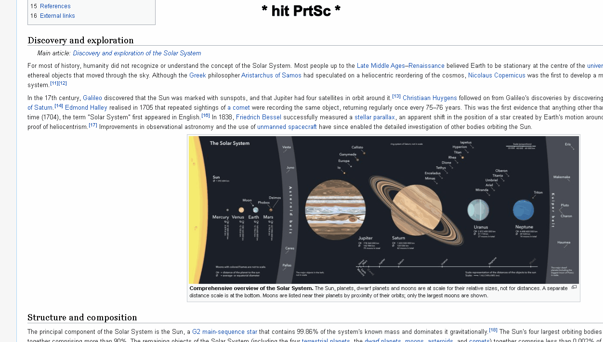

# screenshot-cropper
screenshot cropper is simple to screen shooter that crop the screenshot based on your mouse clicks

## Install Requirements
```
pip install -r requirements.txt
```

## Running

It is possible to run this python code both __.py__ and __.exe__.
### .py

```
python screenshot-cropper.py
```
 ### .exe
 
You can just simply double click on the executable file I added, `screenshot-cropper.exe`.\
Or If needed you can convert the `screenshot-cropper.py` to `.exe` by using the library [pyinstaller](https://pypi.org/project/PyInstaller/)

## Usage

The idea of this script is to make screenshotting your monitor more efficient.\
The default key for the screenshot is [Print Screen key](https://en.wikipedia.org/wiki/Print_Screen).

After hitting the __PtrSc__ key you will Have 2 options:
* __Croping__- need to make 2 __Left__ clicks with the mouse like you try to crop or select your section out of the screen.\
like you would use in a picture editing program.
* __Full screenshot__- just 1 __Right__ click

Save as window will pop up for saving you cropped/full-screen shot.\
Screenshot from the site [Solar System - Wikipedia](https://en.wikipedia.org/wiki/Solar_System)



### Close the program

Just hit the Control key(__ctrl__) + Print Screen key(__PtrSc__) And the program will teminate

 
